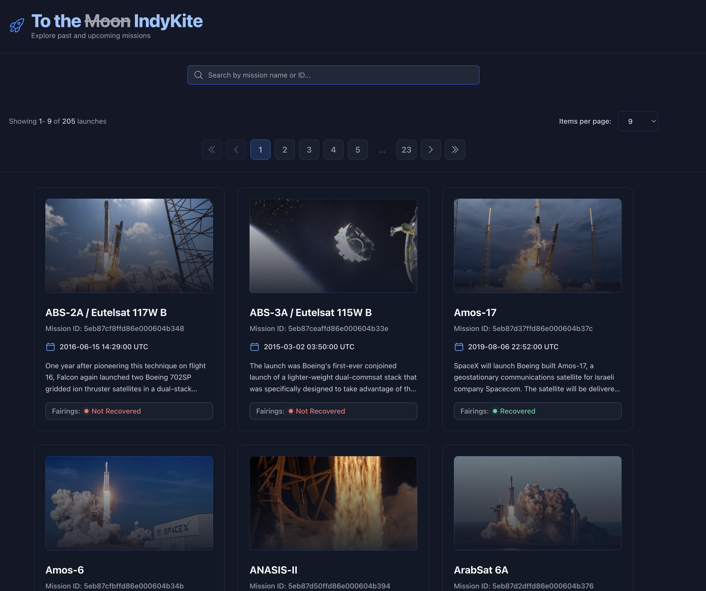

# 🚀 To The Moon (or to something bigger? 😊)

## Launch Sequence

1. Launch the development server:

`npm run dev`

2. Access the application at \`http://localhost:3000\`

## 🛠️ Development Tools

- **Component Docs**:

  `npm run storybook`

- **Testing**:

  # Unit Tests
  `npm run test:unit`

  # E2E Tests
  `npm run test:e2e`

## 🌌 Mission Overview

Welcome to the SpaceX Launch Explorer, a next-generation web application that provides real-time access to SpaceX launch data through an advanced GraphQL interface. This mission-critical system allows space enthusiasts to explore and search through SpaceX's historic launches with unprecedented ease.

## 🛸 Features

### Core Capabilities
- **Launch Data**: Access comprehensive data on all SpaceX launches
- **Intelligent Search**: Advanced search functionality for mission names and IDs
- **Automated Sorting**: Missions arranged alphabetically for optimal navigation
- **Pagination**: Efficient data presentation through paginated results

### Launch Data Display
Each launch entry provides critical mission data:
- 🎯 Mission Name
- 📅 Launch Date (UTC)
- 🖼️ Mission Image
- 📝 Mission Details
- 🛡️ Fairings Recovery Status

## 🛠️ Technology Matrix

### Core Systems
- **Framework**: Next.js + React
- **Type Safety**: TypeScript
- **Data Layer**: Apollo GraphQL
- **Styling**: Tailwind CSS

### Quality Assurance
- ✅ Unit Testing (Vitest)
- 🔄 End-to-End Testing (Playwright)
- 📚 Component Documentation (Storybook)

## 🎨 Component Architecture

Following Atomic Design principles:

### Atoms
- StatusIcon
- LaunchDate
- DetailsParagraph

### Molecules
- Header
- DetailsSection
- ImageSection

### Organisms
- LaunchCard
- LaunchGrid

## 🌟 Mission Requirements

### User Interface
- [x] Complete launch database display
- [x] Alphabetical mission sorting
- [x] Comprehensive launch details
- [x] Advanced search capabilities
- [x] Efficient pagination system

### Technical Implementation
- [x] Next.js & React framework
- [x] TypeScript integration
- [x] Unit testing implementation
- [x] E2E testing suite
- [x] Storybook documentation
- [x] Focus on UX
- [x] Focus on performance

## 🔭 Room for future improvements:

- [ ] Feature proposal: Advanced filtering options
- [ ] Feature proposal: Offline mode support
- [ ] Better caching strategy
- [ ] More tests! (see TODOs for e2e test in the codebase)
- [ ] DX improvements (ex.: pagination logic code can be simplified - to follow more declarative style)
- [ ] Architecture: Implement FSD architecture - for better separation of concerns (chosen simple modular approach because it's good enough for quick prototyping)
- [ ] UX: Make even better:
- 1. Improve search component experience - allow to clean up the field clicking "x" icon button.
- 2. Add virtualization for lists when >= 36 launch cards are visible.
- [ ] UI adaptivity: We can do even better here! Especially - for pagination component!
- [ ] Performance: move more logic on a server side (such as sorting by launch name and search logic)

*Through hardships to the stars (or to something bigger?)* 😊